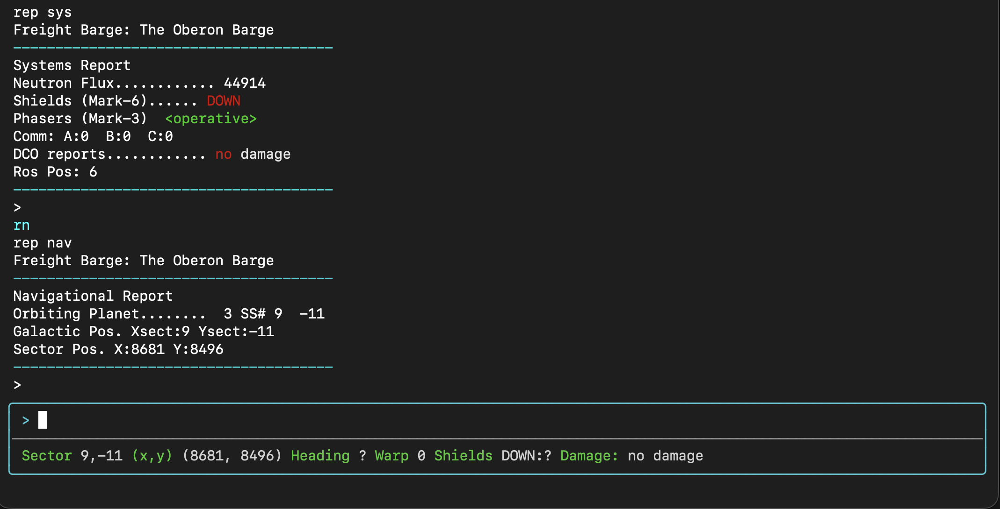

# Baud Scripts for Playing Galactic Empire

[baud] scripts for playing [GE]

## Status Bar

## Navigation

* Navigate to a planet 3 (in the current sector): `nav.to 3`
* Scan ship A and navigate to it: `nav.to A`
* Navigate to sector 10, -5: `nav.to 10 -5` (defaults to x = 5000, y = 5000) in that sector
* Navigate to coordinates x = 3000, y = 7000 in sector 10, 5: `nav.to 10 -5 3000 7000`
* Navigate to a sector 10, -5 and then orbit planet 3: `nav.to 10 -5 3`
* Navigate to coordinates x = 3, y = 7000 in sector sector 10, -5 and then orbit planet 3 `nav.to 10 -5 3000 7000 3`
* Cancel active navigation: `nav.cancel`

## Aliases

## Triggers

## Project Structure

See [README_FILES.md]

## Development

See [README_DEV.md]

[README_DEV.md]: ./README_DEV.md
[README_FILES.md]: ./README_FILES.md
[baud]: https://github.com/jedcn/baud
[GE]: https://wiki.mbbsemu.com/doku.php?id=modules:mbmgemp
